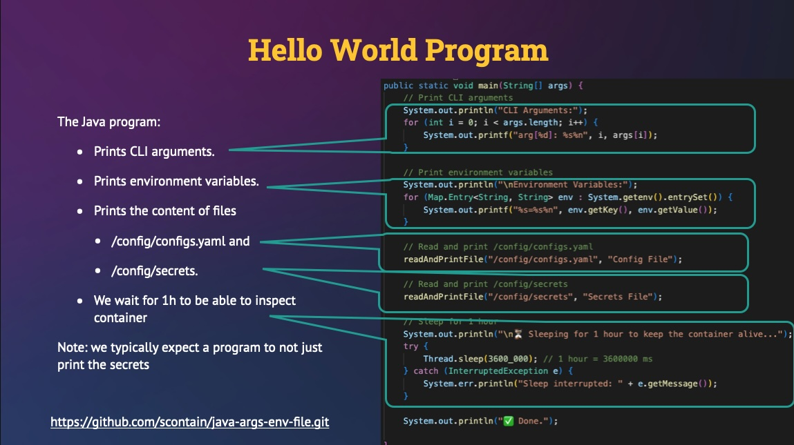
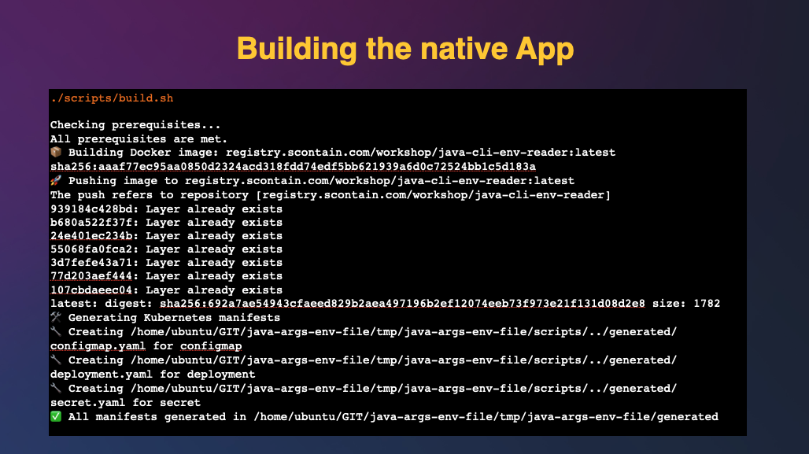
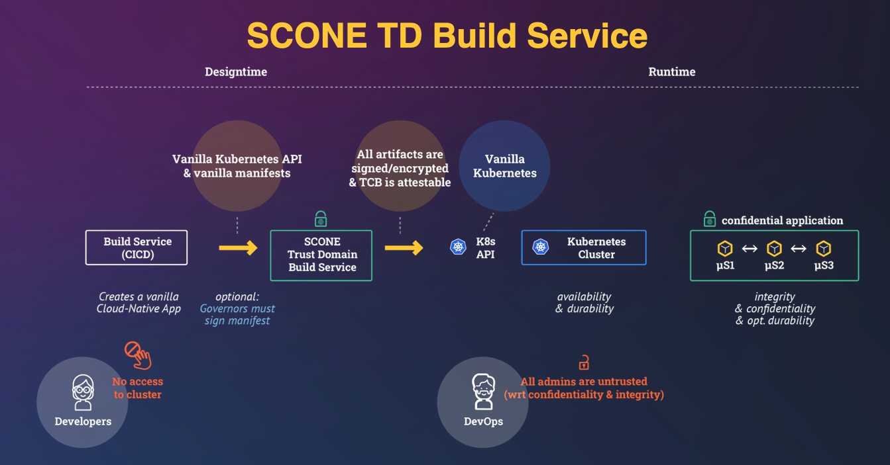
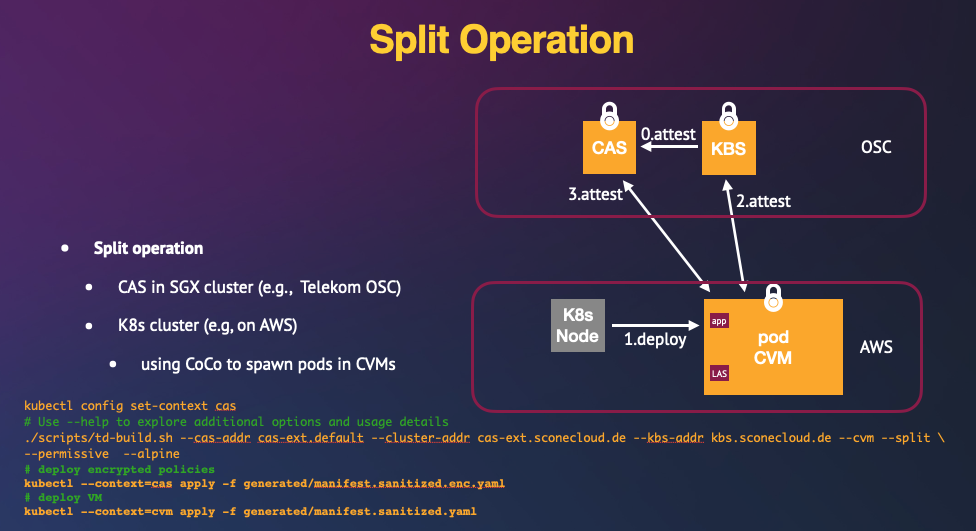

# Java Tutorial

This is a simple tutorial on how to convert a very basic cloud-native application into a confidential cloud-native application. This example runs on different CPUs:

 - Intel SGX, 
 - Intel TDX, and
 - AMD SEV SNP 

and on different cloud providers: 

- Microsoft Azure, 
- Google Cloud, 
- AWS, and 
- [Telekom OSC](https://www.t-systems.com/de/de/souveraene-cloud/loesungen/open-sovereign-cloud).

We use a simple Java program to demonstrate the steps. We include slide decks to explain the different steps and screencasts to demonstrate the execution of the different steps. To run the code yourself, you need to get access to the **production** container images on [`registry.scontain.com`](gitlab.scontain.com). 

## Java Application

The Java program:

- Prints CLI arguments.
- Prints environment variables.
- Prints the content of /config/configs.yaml and /config/secrets.

## Kubernetes Manifests

- Deploy the Java application.
- Mount a ConfigMap to /config/configs.yaml.
- Mount a Secret to /config/secrets.

For more details, see the following slide deck: 

[](docs/Java-Tutorial-Native-Version.pdf)

## Prerequisites

Make sure you have installed all necessary software on your development machine and your Kubernetes cluster by clonging repository <https://github.com/scontain/scone.git> and following the `README.md`. Basically, execute in repo `scone`

- `./scripts/prerequisite_check.sh` to install all necessary commands,
- `./scripts/reconcile_scone_operator.sh` check that your Kubernetes cluster is properly configured, and
- `./scripts/install_cas.sh` to ensure that CAS instance `cas` exists in Kubernetes namespace `default`.

## Running the tutorial

The following scrips that are found in the `scripts` directory:

- `build.sh`: build the container image and the manifests. Run `build.sh --help` to learn how to customize this build step. 
- `deploy.sh`: deploys the manifests in the default namespace.
- `show_logs.sh`: show the log of the pod
- `cleanup.sh`:  removes all resources

For more details, see the following slide deck: 

[](docs/running-the-native-java-app.pdf)

### Run `build.sh`

Run the following script to build the container image and generate the Kubernetes manifests:

```sh
# example: ./scripts/build.sh --repo registry.scontain.com/workshop/java-cli-env-reader
./scripts/build.sh --repo your-registry-url/your-repo/java-cli-env-reader
```

You can customize the build process by using command-line options. To see all available options:

```sh
./scripts/build.sh --help
```

> **Example:** By default, we use image tag `latest`. You can set the tag using option  `--tag <tag>`

To produce smaller images, you can create the application an Alpine instead:

```sh
./scripts/build.sh --alpine
```

Note that CVMs on some cloud providers are sensitive to pulling large images from remote registries. Hence, using small images helps to reduce the startup times and avoid timeouts because of long image pull times.

Screencast of building the native application:


### Run `deploy.sh`

You can deploy the native application with the help of script `deploy.sh`:


### Threat Model

In a first approximation, 

- we cannot trust any person that has access to the computing infrastructure, and
- we cannot trust hardware and software components unless we securely measured the components and the measured values match our expected values.

For more details, see the following slide deck: 

[](docs/Java-App-Threat-Model.pdf)


### Trust Domain Build `td-build.sh`

We transform previously built Docker image and generated Kubernetes manifests using the **SCONE TD Build Service**.

For more details, see the following slide deck: 

[](docs/SCONE-TD-Build-Service.pdf)


When you run the CAS in the same cluster, you can just execute 

```sh
# Use --help to explore additional options and usage details
./scripts/td-build.sh
```

In case there are any vulnerabilities in the cluster, attestation will fail. Please add flag `--permissive` to build the application again.

```sh
# Use --help to explore additional options and usage details
./scripts/td-build.sh --permissive
```

Screencast of transforming the native application into a confidential application:


### Confidential Deployment

Deploy the confidential application by executing

```bash
kubectl apply -f generated/manifest.sanitized.yaml
```

Screencast of deploying the confidential application:


### Split Deployment



We talk about a **split deployment** when you run the application in one Kubernetes cluster and the SCONE CAS in a different cluster. The cluster could even run in different clouds.

To use CAS in a different cluster, we assume that you have two Kubernetes contexts:

- context `cvm` runs the CVMs, and
- context `cas` runs the SCONE CAS.

We check that these two clusters exists as follows:

```sh
if kubectl config get-contexts -o name | grep -q '^cas$'; then
  echo "Context 'cas' exists"
else
  echo "ERROR: Context 'cas' not exist"
  exit 1
fi
if kubectl config get-contexts -o name | grep -q '^cvm$'; then
  echo "Context 'cvm' exists"
else
  echo "ERROR: Context 'cvm' not exist"
  exit 1
fi
```

You can merge two configs as follows:

```sh
CVM_KONTEXT=$(realpath ~/.kube/cvm-context)
CAS_KONTEXT=$(realpath ~/.kube/cas-context)
mv ~/.kube/config-cvm-cas ~/.kube/config-cvm-cas.bak || true
KUBECONFIG="$CVM_KONTEXT" C_CVM_KONTEXT=$(kubectl config current-context)
KUBECONFIG="$CAS_KONTEXT" C_CAS_KONTEXT=$(kubectl config current-context)
echo "C_CVM_KONTEXT=$C_CVM_KONTEXT C_CAS_KONTEXT=$C_CAS_KONTEXT"

KUBECONFIG="$CVM_KONTEXT:$CAS_KONTEXT" kubectl config view --flatten > ~/.kube/config-cvm-cas
export KUBECONFIG=$(realpath ~/.kube/config-cvm-cas)
kubectl config rename-context $C_CVM_KONTEXT cvm
kubectl config rename-context $C_CAS_KONTEXT cas
kubectl config view
```

```sh
kubectl config set-context cas
# Use --help to explore additional options and usage details
./scripts/td-build.sh --cas-addr cas-ext.default --cluster-addr cas-ext.sconecloud.de --kbs-addr kbs.sconecloud.de --cvm --split --permissive
```

> **Note:** Before running this script, make sure your `kubeconfig` is configured to point to the target SGX-enabled Kubernetes cluster. Also, make sure to set the `--cluster-addr` according to your environment, using the correct `name.namespace` format that matches your CAS deployment.

### Deploying in two clusters

Apply the generated encrypted policies (in the SGX-enabled cluster):

```sh
kubectl --context=cas apply -f generated/manifest.sanitized.enc.yaml
```

Then deploy the workload using:

```sh
kubectl --context=cvm apply -f generated/manifest.sanitized.yaml 
watch kubectl --context=cvm get pods
```

> **Note:** If your container images are stored in a private registry, you must create a Kubernetes secret to allow image pulling:

```sh
# Replace <REGISTRY>, <USER> and <TOKEN> with your actual registry credentials
kubectl create secret docker-registry sconeapps \
    --docker-server=<REGISTRY> \
    --docker-username=<USER> \
    --docker-password=<TOKEN>
```

### See application logs

Streams logs from the pod created by the Kubernetes Job: java-cli-env-reader.

```sh
./scripts/show-logs.sh
```

> **Note:** If you have used the `--namespace` flag at `build.sh`, use same namespace here.

### Cleanup

To stop the application, you can delete its `deployment`:

```bash
kubectl delete deployment java-cli-env-reader
```

To delete all Kubernetes resources created from generated manifests and the local files, execute:

```sh
# Use --help to explore additional options and usage details
./scripts/cleanup.sh
```

## Showing the secrets

We can decode the Kubernetes secret with the help of script `decode_secret.sh`.

## Monitoring

One can monitor the memory consumption inside of an enclave by setting within the enclave environment

```yaml
    - { name: SCONE_METRICS, value: "prometheus_port:9999" }
```

This will activate a metric port for Prometheus to collect memory metrics of the enclave.

For Prometheus to be able to collect this metric, we need to make this metric port available as an Kubernetes endpoint. We can achieve this by executing

```bash
kubectl apply -f monitoring/metrics_service.yaml
```

Next, we need to ensure that Prometheus discovers this endpoint. We create a `ServiceMonitor` for our application:

```bash
kubectl apply -f monitoring/metrics_service.yaml
```
